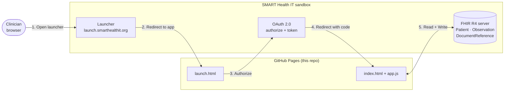
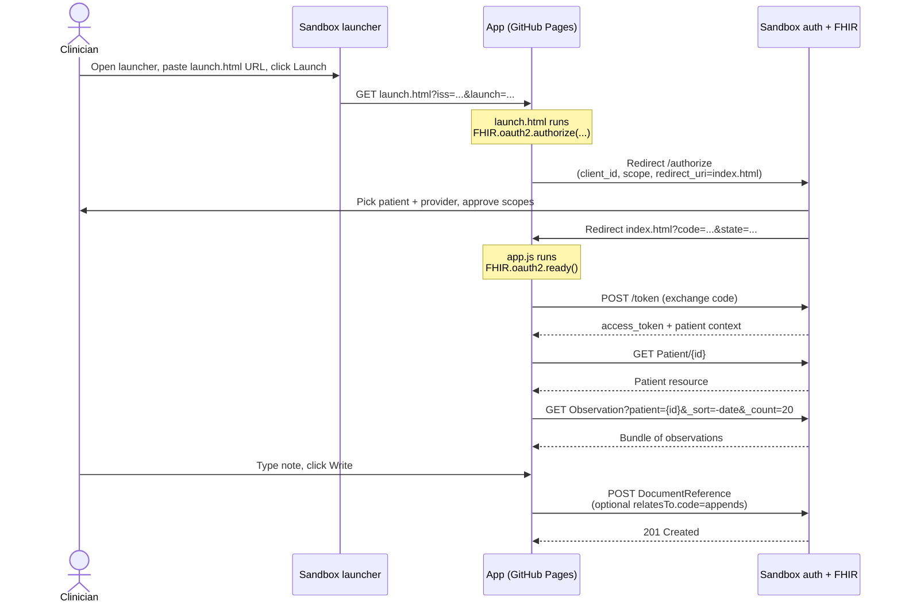

# SMART on FHIR demo

A ~100-line SMART on FHIR app that launches inside a sandbox EHR, reads the patient and their recent observations, and writes a clinical note (`DocumentReference`) back — either as a new note or as an addendum to the most recent one.

Built against the public [SMART Health IT sandbox](https://launch.smarthealthit.org). No backend, no build step — single-page app served as static files.

## Why this exists

A working reference for the parts of SMART on FHIR that matter for ambient clinical apps: the launch + OAuth flow, the FHIR resources a scribe-style product actually touches (`Patient`, `Observation`, `DocumentReference`), and the addendum-vs-edit distinction that EHRs handle differently in the wild.

Most public SMART demos only read. This one also writes back, which is where the interesting integration questions live.

## Architecture



Only three files run in the browser. Everything on the right (launcher, auth server, FHIR server) is the sandbox simulating what a real EHR would expose. In production this same app would point at Epic / Cerner / Athena's SMART endpoints instead.

## Run it

1. Host the three files (`launch.html`, `index.html`, `app.js`) on any static host. GitHub Pages on `main` / root works out of the box.
2. Open the SMART App Launcher: <https://launch.smarthealthit.org>
3. Pick **Provider EHR Launch**, FHIR version **R4**, leave the rest default.
4. In **App Launch URL**, paste your hosted `launch.html` URL.
5. Click **Launch**. Pick a patient and a provider when prompted.
6. After auth, you'll see Patient + Observations, plus a textarea to write a note back.

## Files

| File | What it does |
| --- | --- |
| `launch.html` | Initiates the SMART OAuth flow via `FHIR.oauth2.authorize(...)`. Requests `patient/Patient.read`, `patient/Observation.read`, `patient/DocumentReference.write`. |
| `index.html` | Post-auth landing page. Renders patient header, observations table, and the write-back form. |
| `app.js` | Calls `FHIR.oauth2.ready()` to get a client, fetches resources, and posts the `DocumentReference`. |

## Launch flow

What actually happens between clicking Launch and seeing the patient data, with every redirect spelled out:



The two HTML files exist because SMART splits the flow in two: `launch.html` only fires `authorize()`; the browser then bounces through the auth server and lands on `index.html`, where `ready()` completes the token exchange and hands back a client. `fhirclient.js` persists the in-between state in `sessionStorage`.

## The addendum-vs-edit bit

When the "addendum" checkbox is ticked, the new `DocumentReference` is created with:

```json
"relatesTo": [{
  "code": "appends",
  "target": { "reference": "DocumentReference/<previous-id>" }
}]
```

This is the FHIR-canonical way to say "this note appends the previous one" rather than replacing it (`replaces`) or transforming it (`transforms`). Different EHRs interpret these codes differently in their UIs (Cerner's addendum behaviour is the classic example), which is exactly the kind of EMR-reality-vs-spec gap a real integration has to deal with.

## What this deliberately doesn't do

- No backend — the sandbox lets you use a public client, so there's no token exchange to protect.
- No production EHR vendor quirks — that's the whole point of the sandbox; this is the spec-clean baseline you'd then layer Epic / Cerner / Athena-specific handling on top of.
- No FHIR resource validation beyond what the server enforces.

## What a real EHR adds on top of this

The sandbox gives you a spec-clean baseline. Production EHR integration is mostly about what the spec leaves under-specified or what individual vendors do differently. The list of things this demo would need to grow before pointing at a real Epic / Cerner / Athena endpoint:

- **Token refresh.** Sandbox tokens live long enough for a demo. Real tokens expire mid-session — need the `offline_access` scope and a refresh-token flow.
- **Scope downgrade.** The EHR admin may grant fewer scopes than the app asked for. The app has to inspect what it actually got back and degrade gracefully instead of assuming.
- **Encounter context.** A real note belongs to a *visit*, not just a patient. Without an `Encounter/{id}` binding the note may not appear in the encounter summary the clinician is looking at.
- **Vendor-specific note types.** LOINC `11506-3` works in spec. In practice Epic / Cerner / Athena have their own note-type catalogues (often vendor-prefixed) and reject arbitrary LOINC codes silently or with cryptic errors.
- **Sectional write-back.** Production notes split into HPI / Assessment / Plan / etc., each mapped to a specific field in the EHR's note template. The `DocumentReference` becomes a wrapper around many sub-writes, not a single blob.
- **Addendum vs edit, enforced.** Some EHRs forbid editing a finalised note and only allow addenda (Cerner). Others allow `PUT` overwrites. Same app code, different vendor branches.
- **Provenance and audit.** Every write needs a `Provenance` resource so the EHR can attribute the note to ambient-AI-with-clinician-review rather than a human author. Often a regulatory requirement, not optional.
- **Retry and idempotency.** Sandbox is fast and reliable. Real EHR endpoints time out, return `200` with errors in the body, or partially succeed. Writes have to be retry-safe.
- **Multi-tenancy.** One app, many customer EHRs — each with a different base URL, client ID, scope set, and quirks. The config surface becomes its own product.
- **Certification + change control.** Epic App Orchard registration. Vendor API changes that break you with little notice. Version pinning vs. forward-compatibility trade-offs.

The demo is the easy 20%. The list above is the 80% that decides whether an integration is actually usable in a clinic.

## Stack

- [fhirclient.js](https://github.com/smart-on-fhir/client-js) (the official SMART client library) — handles the OAuth dance and gives you a typed-ish client for FHIR requests.
- Vanilla HTML / CSS / JS. No framework.

## Licence

MIT.
